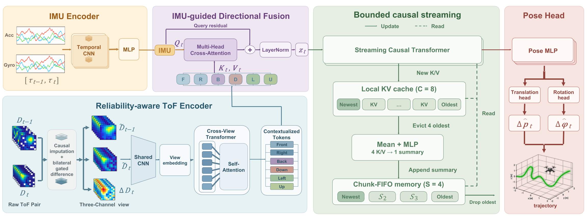

<div align="center">

# TIO-Former

### Ultra-Lightweight 6-Directional ToF-Inertial Odometry for Nano-UAVs via a Streaming Causal Transformer

[](https://arxiv.org/abs/2609.17198)


Yang Liu · Yifan He · Wenhao Zhao · Xiangyu Mo · Yang Xu · Hao Wei<br>
Mingze Ma · Huan Li · Yifan Wu · Zipeng Dai · Xin Zhou · Fei Gao

Zhejiang University · Differential Robotics

**arXiv 2026**

</div>

## Overview

TIO-Former is a camera-free, optical-flow-free, and mapless range-inertial odometry framework for resource-constrained nano-UAVs. It estimates continuous 6-DoF motion from an IMU and six orthogonal $8\times8$ time-of-flight (ToF) arrays with a total ToF payload of only 15 g.

Sensing | → | Directional fusion | → | Bounded streaming | → | Edge deployment
:---: | :---: | :---: | :---: | :---: | :---: | :---:
384 ranges per frame | | IMU-guided cross-attention | | Local KV + Chunk-FIFO | | 10.466 ms P95

The reliability-aware frontend suppresses artifacts caused by invalid ToF returns. IMU-guided cross-attention dynamically selects informative directional features, while a Streaming Causal Transformer maintains fixed per-step computation and memory through an uncompressed Local KV cache and compressed Chunk-FIFO memory.

<p align="center">
  
</p>

<p align="center"><em>Architecture of TIO-Former.</em></p>

## News

- **[Sep 15, 2026]** The paper is available on [arXiv](https://arxiv.org/abs/2609.17198).
- **[Sep 14, 2026]** The repository was created. Code, pretrained models, and the dataset will be released here.

## Abstract

Autonomous nano-UAV navigation requires accurate ego-motion estimation under stringent size, weight, power, and computing (SWaP-C) constraints, where visual sensors and LiDARs exceed payload limits, optical flow degrades in low-texture scenes, and inertial-only state estimation is susceptible to accumulated drift.

While multi-zone time-of-flight (ToF) arrays provide a lightweight metric complement, 6-DoF estimation from merely 384 ranges per frame is challenged by invalid returns, anisotropic observability, and temporal computational scaling. We propose TIO-Former, a camera-free, optical-flow-free, and mapless range-inertial odometry framework driven by an IMU and an ultra-lightweight (15 g) payload of six orthogonal $8\times8$ ToF arrays.

Our frontend pairs consecutive range grids with a bilateral gated difference, while IMU-guided cross-attention dynamically routes directional features conditioned on platform kinematics. A Streaming Causal Transformer couples an uncompressed Local KV cache with compressed Chunk-FIFO memory, maintaining bounded inference cost and memory footprint independent of flight duration.

In real-flight evaluations, TIO-Former reduces open-loop position error by 54.4% compared to nano-UAV optical flow and by 66.4%–89.1% over learned inertial baselines. We also evaluate performance across multiple environments and robustness under severe sensing degradation.

Deployed on an edge RISC-V companion computer, TIO-Former achieves a P95 latency of 10.466 ms and peak resident memory of 6.324 MiB (less than 5% system RAM), demonstrating that sparse range sensing provides practical geometric anchoring for resource-constrained micro-aerial robots.

## Release Status

Resource | Status
:--- | :---
Paper | [Available on arXiv](https://arxiv.org/abs/2609.17198)
Training and evaluation code | Coming soon
Pretrained models and configurations | Coming soon
Dataset and preparation tools | Coming soon

## Acknowledgements

This work was conducted during the author's internship at Differential Robotics, under the mentorship of [Zipeng Dai](https://scholar.google.com/citations?hl=zh-CN&user=e2c7Kt0AAAAJ).

## Citation

If you find this work useful, please cite:

```bibtex
@misc{liu2026tioformer,
  title         = {TIO-Former: Ultra-Lightweight 6-Directional ToF-Inertial Odometry for Nano-UAVs via a Streaming Causal Transformer},
  author        = {Liu, Yang and He, Yifan and Zhao, Wenhao and Mo, Xiangyu and Xu, Yang and Wei, Hao and Ma, Mingze and Li, Huan and Wu, Yifan and Dai, Zipeng and Zhou, Xin and Gao, Fei},
  year          = {2026},
  eprint        = {2609.17198},
  archivePrefix = {arXiv},
  primaryClass  = {cs.RO},
  url           = {https://arxiv.org/abs/2609.17198}
}
```

## Contact

For questions about the paper or future releases, please open an issue in this repository.
